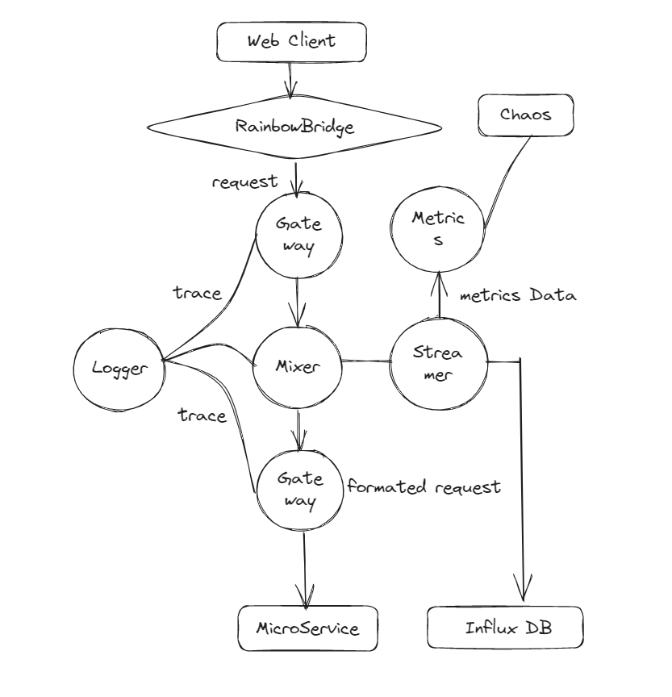

# SPEC of RainBowBridge

## RB设计架构

RB的结构参照了istio包含5大模块

- Gateway 网关（入口网关和出口网关），鉴权，流量控制，代理转发
- Mixer 流量混合
- Streamer 对接InfluxDB，序列化流数据
- Metrics 采集流数据，供Chaos服务做展示
- Logger 日志服务器

## Gateway

网关作为流量的出入口，负责对接外部的web客户端和服务间的流量

为此Gateway会代理如下流量

- tcp（基础协议）
- udp（基础协议）
- GRPC （服务间通信）
- http
- https
- http2
- http3

UDS由专门负责内部通信的`octopusTwig`负责

## Mixer

流量混合， 负责对请求进行预置处理

## Streamer

为保证流量的全局可追踪， 数据可视化

会为所有的请求增加TraceID， 记录流量的来源和最终目的地，并记录到流数据库中

## Logger

日志服务器，为了性能，日志的写入不要求实时，会使用任务队列的方式记录日志

## Metrics

度量数据的提取与聚合

## RB -> Chaos

`Chaos`是专为RB设计的可视化数据面板

记录如下几个维度的数据

### RB性能

- 全局的时间段QPS
- 全局的时间段CPU, 内存占用， IO
- 全局的请求状态统计（成功， 失败， 阻塞，异常）
- 各个微服务请求占比

### 流量指标

- 微服务的时间段QPS
- 微服务入口流量大小
- 微服务请求状态统计（成功， 失败， 阻塞，异常）
- 微服务请求流统计分析（请求url， 方式，body大小，响应时长）

### 微服务性能指标

微服务的性能指标，时间段内的CPU, 内存，句柄， IO读写，消耗数据